An affine transformation is a geometrical transformation which moves points in space such that points which were lying on a line remain so after the transformation.

Given a point which is a point location [x, y]T , transformed location after translation, rotation and scaling can be as follows.

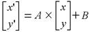

|Translation  |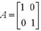 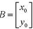|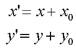| 	
|-------------|----------------------------------------------------------------|-------------------------------|
|Rotation (θ)|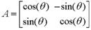 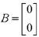 |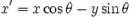|
|             |                                                                |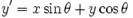|	
|-------------|----------------------------------------------------------------|-------------------------------|
|Scaling      |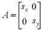 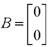 |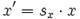| 
|             |                                                                |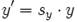|    	

	
To geometrically transform an image, the result we seek is an image with transformed coordinates. The result of applying the transformation function is generally not an integer particularly in case of rotation and scaling. This poses a problem since the image is defined on a grid (coordnates have to be integer valued). The solution is interpolation.

n implementation, image rotation is done as follows. Given I[m,n] to find a transformed image X[m., n.] where [m., n.]= A x [m, n] + B according to the above given equation:

 1. Create a dummy array X[m., n.].
 2. Find the locations [m, n] in I that correspond to locations [., n.] in the image X by applying the inverse transformation. I.e. A-1 ([m., n.]-B) = [m, n]. This can result in non-integer locations.
 3. Find the pixel value at these source locations. If it is non-integer valued locations, use an interpolation function.

Example: Consider A to be rotation by 30 degrees. Let us take the location [12, 13] in X and find its corresponding location in I. This will be [3.89 17.26]. To determine the value of I at this location, we can use the known values closest to this location

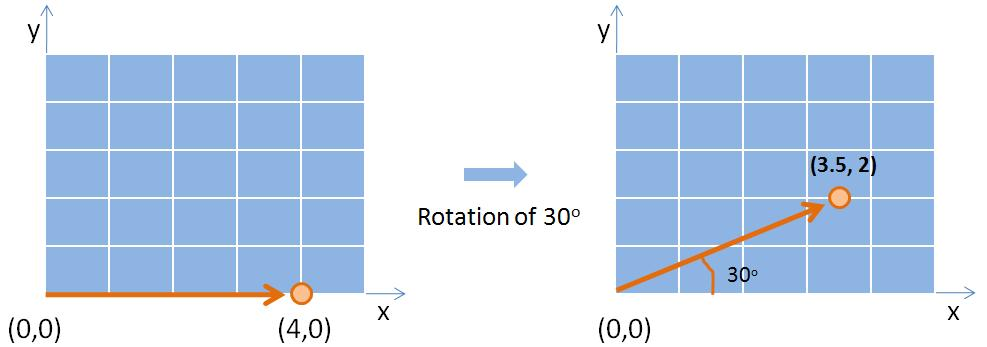

     
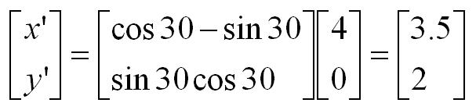

**Option 1:** Round off the [m, n] and take the pixel value at that location. This is known as the nearest neighbour interpolation method.

**Option 2:** Take the weighted average of the 4 neighbouring pixels. The weights are the distance between the desired location and that of the neighbours. The common form is the bilinear form which is a second order approximation and equivalent to fitting a straight line pairs of neighbouring pixels.

**Option 3:** Take a nonlinear combination of the 16 neighbouring pixels. The standard is to use a third order approximation and fit two piecewise cubic polynomials on to the neighbouring pixels. Hence the interpolation function is called the bicubic interpolation method.